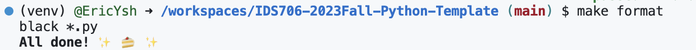
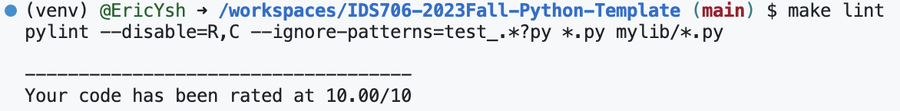
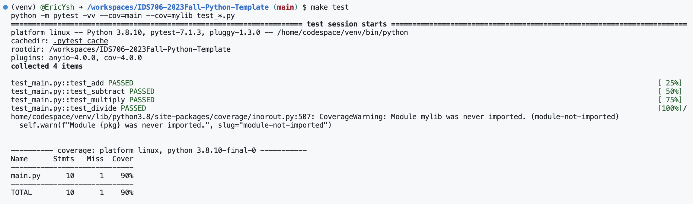

# Template for IDS706 weekly mini-projects 

## Goal

> Duke University IDS 706 Weekly Mini Project 1

This is a repo template for duke course IDS706 Data Engineering Mini Project (Fall 2023). It contains:

`.devcontainer` includes a Dockerfile and devcontainer.json. The 'Dockerfile' within this folder specifies how the container should be built, and other settings in this directory may control development environment configurations.

`workflows` includes GitHub Actions, which contain configuration files for setting up automated build, test, and deployment pipelines for your project.

`.gitignore` is used to specify which files or directories should be excluded from version control when using Git.

`Makefile` is a configuration file used in Unix-based systems for automating tasks and building software. It contains instructions and dependencies for compiling code, running tests, and other development tasks.

`requirements.txt` is to specify the Python package dependencies (libraries and packages).

`test_main.py` is a test file for main.py that can successfully run in IDEs.

`Github Actions` to run the Makefile as follows: make install, make test, make format, make lint.

## Preparation

1. Open in the Github codespaces
2. Do simple test in the terminal

## Run and Result

This section is saved for later mini projects.
🌰 Example in the Github Codespace 

make format

make lint

make test

## Reference

1.  https://github.com/nogibjj/python-template
2.  https://github.com/helenyjx/Rust-Powered-Calculator-Microservice-in-the-Cloud

