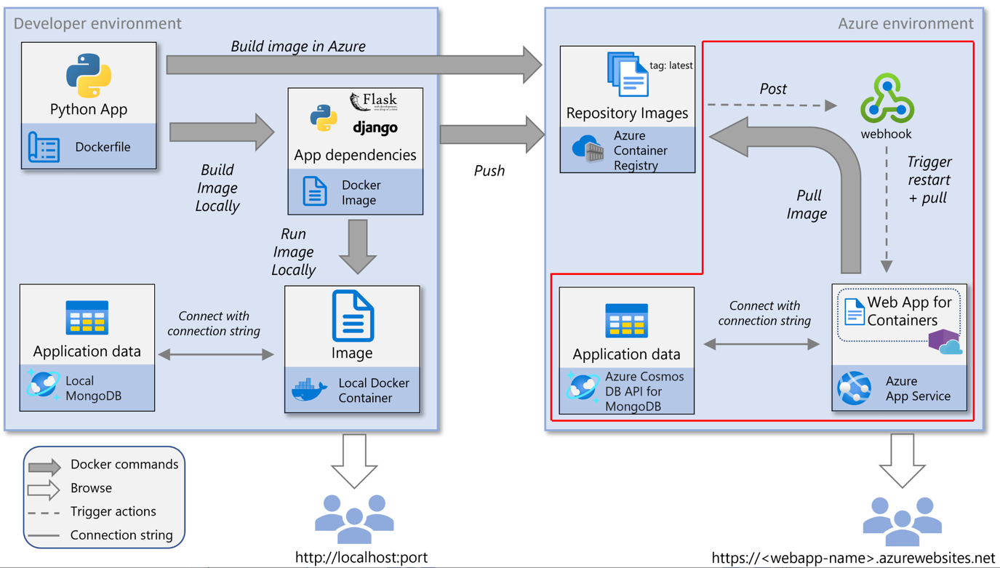
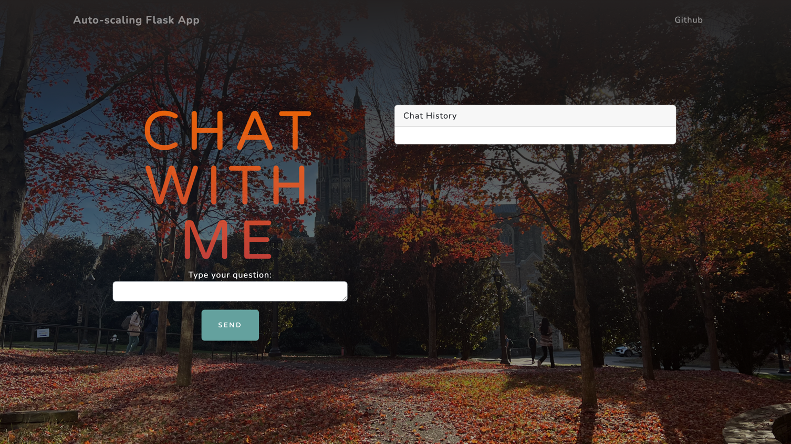
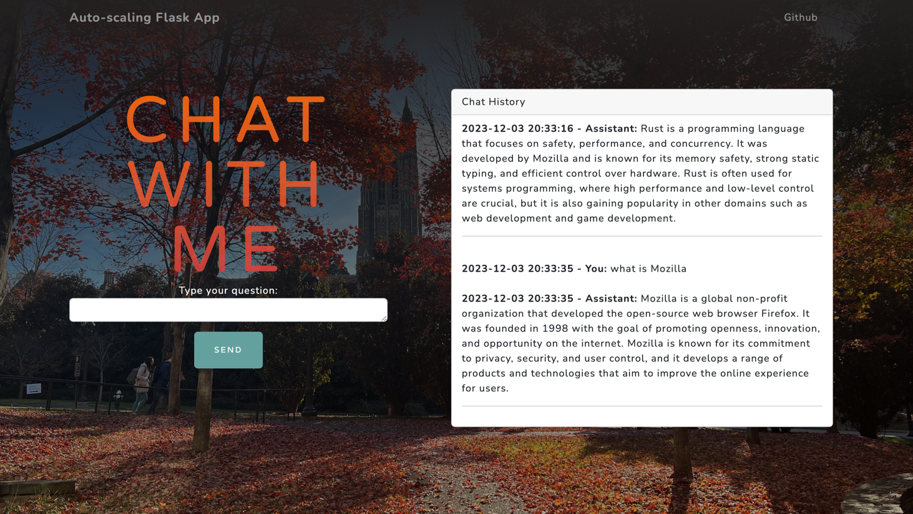

# Auto Scaling Flask App Using Any Serverless Platform

> Duke University IDS 706 Individual Project 4

## Summary

[Website Here](https://flaskapp.ambitiouswater-3b3443ba.centralus.azurecontainerapps.io/)

[Youtube Here](https://youtu.be/vAQaL4uKK0k)

This project is a publicly accessible auto-scaling container using Azure App Services and Flask, integrating with OpenAI API to provide a question answering service.

- Backend: Python, Flask. The `app.py` is the main file to run the app.
- Frontend: Bootstrap4. The `index.html` is the main file display the front-end. Also including a `header.html` and `footer.html` to organize the layout.

## Preparation

1. Python 3.9 (3.8 is also fine)
2. Docker
3. Azure CLI
4. Azure Container Registry
5. Flask
6. gunicorn
7. openai lib with 0.28 version (above 0.28 version is not compatible with my LLM Implementation) 
8. flask_bootstrap 
9. python-dotenv
10. Create Azure resource Group
11. Bootstrap 4

## Container App Workflow

1. Clone the repo
2. Build the image: `docker build --tag flaskapp .`
3. Run the container locally: `docker run --detach --publish 8080:50505 flaskapp`, then you could visit the app at `http://localhost:8080/`
   1. If you want stop locally:
   2. Run `docker ps` to find running CONTAINER ID
   3. Then `docker stop ID`
4. Deploy to Azure ` az containerapp up --resource-group EricsCluster --name flaskapp --ingress external --target-port 50505 --source .`

When you run az containerapp up with the `--source .` flag, it performs several actions:

1. Creates a Docker Image: Azure CLI will automatically generate a Docker image from the current directory (.). This means it will use the Dockerfile in the current directory to build the image. If there's no Dockerfile, it tries to create one based on the language and framework it detects in your application.

2. Pushes the Image to a Container Registry: This image is then pushed to a container registry. Azure CLI will use Azure Container Registry (ACR) if available, or create one if necessary.

3. Deploys the Image to Azure Container Apps: Finally, the image is deployed as a container app in Azure.

## Run and Result

### Local Running
1. Clone this Repo
2. Build the image: `docker build --tag flaskapp .`
3. Run the container locally: `docker run --detach --publish 8080:50505 flaskapp`, then you could visit the app at `http://localhost:8080/`
4. Make sure you have the `openai` API key in your `.env` file
5. Make sure you have port 8080 available
   1. If you want stop locally:
   2. Run `docker ps` to find running `CONTAINER ID`
   3. Then `docker stop ID`

### Online URL
[Flask app with LLM](https://flaskapp.ambitiouswater-3b3443ba.centralus.azurecontainerapps.io/)

### Main interface

### Interaction
- You could type your query in the input box and click the `Send` button to get the result.

## Reference

1. https://github.com/nogibjj/python-template
2. https://startbootstrap.com/
3. https://learn.microsoft.com/en-us/azure/developer/python/tutorial-containerize-simple-web-app?tabs=web-app-flask
4. https://www.youtube.com/watch?v=wkZjlVgK6pA&ab_channel=NovinTech
5. https://favicon.io/favicon-generator/ `Duke Blue Hex color: #012169`
6. BG image is shot on my iPhone

